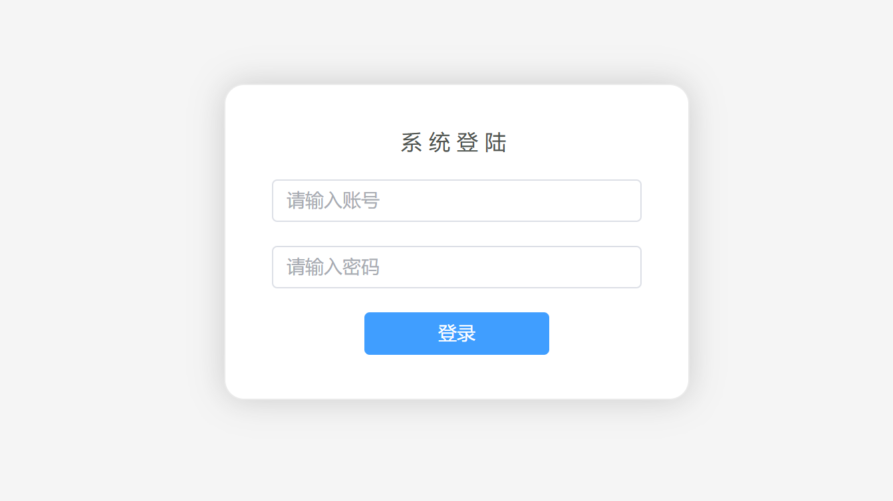

## 通用后台管理系统
>采用**`vue3+vite`**构建</br>

## 编写语言
* **`JavaScript`**</br>
* **`Vue`**</br>
* **`Less`**</br>
* **`CSS`**</br>
* **`HTML`**</br>
  
## 技术栈
* **`element-plus`**：快速搭建网页UI</br>
* **`vue-router`**：实现动态路由，路由守卫，token验证</br>
* **`axios`**：路由请求二次封装</br>
* **`vuex`**：实现多组件间的通信交互</br>
* **`mockjs`**：实现数据模拟</br>
* **`localStorage`**：实现数据暂存</br>

## 运行环境
* **`node@20.15.0`**</br>
* **`npm@10.7.0`**</br>

## 运行使用
>**在项目跟目录打开终端运行以下命令**
* **安装依赖：```npm install```**</br>
* **项目运行：```npm run dev```**</br>

## 项目效果图
* 登陆页面展示：
</br>
* 主页展示：
</br>
* 用户管理页面展示：
</br>
* 对话框展示：
</br>
* 面包屑展示：
</br>
